# gradle
Gradle 是一款强大的构建工具，而且许多文章也仅仅都把 Gradle 当做一款工具对待。但是，Gradle 不仅仅是一款强大的构建工具，它看起来更像是一个编程框架。Gradle 的组成可以细分为如下三个方面：

* 1）、groovy 核心语法：包括 groovy 基本语法、闭包、数据结构、面向对象等等。
* 2）、Android DSL（build scrpit block）：Android 插件在 Gradle 所特有的东西，我们可以在不同的
build scrpit block 中去做不同的事情。
* 3）、Gradle API：包含 Project、Task、Setting 等等。
# gradle for android
com.android.application学习，[https://developer.android.com/studio/build?hl=zh-cn](https://developer.android.com/studio/build?hl=zh-cn)
# 常用命令

    # 查看任务
    ./gradlew tasks
    # 查看所有任务 包括缓存任务等
    ./gradlew tasks --all
    # 对某个module [moduleName] 的某个任务[TaskName] 运行
    ./gradlew :moduleName:taskName
    # 查看构建版本
    ./gradlew -v
    # 清除build文件夹
    ./gradlew clean
    # 检查依赖并编译打包
    ./gradlew build
    # 编译并安装debug包
    ./gradlew installDebug
    # 编译并打印日志
    ./gradlew build --info
    # 译并输出性能报告，性能报告一般在 构建工程根目录 build/reports/profile
    ./gradlew build --profile
    # 调试模式构建并打印堆栈日志
    ./gradlew build --info --debug --stacktrace

    // 1、使用 -b 执行 app 目录下定义的 task
    ./gradlew -b app/build.gradle MyTask
    // 2、在大型项目中我们一般使用更加智能的 -p 来替代 -b
    ./gradlew -p app MyTask
# 优化gradle构建速度
* implementation，特点是 将该依赖隐藏在内部，而不对外部公开。比如在组件化项目中，有一个 app module 和一个 base module，app moudle 引入了 base module。其中 base module 使用 implementation 依赖了 Glide 库，因为 implementation 是内部依赖，所以是无法调用到 Glide 库的功能的。因此 implementation 可 以 对外隐藏不必要的接口，并且，使用它可以有效地 提高编译速度。比如，在组件化项目中一般含有多个 Moudle 模块，如 Module A => Module B => Moudle C, 比如 改动 Moudle C 接口的相关代码，如果使用的是 implementation，这时候编译只需要单独编译 Module B 模块就行，但是如果使用 api 或者旧版本的 compile，由 于Module A 也可以访问到 Moudle C，所以 Module A  部分也需要重新编译。所以，在使用无错的情况下，可以优先使用 implementation。

* InstantRun
    1、减少构建和部署 app 到手机的时间。
    2、热更新代码改动，无需重启 app 或者 activity。

* ApplyChanges
找出 AndroidStudio 构建出来的 apk 和已经安装到手机设备 apk 的差异。找出差异后，然后将差异发送到手机上执行差异合并。Apply Changes 的限制某些代码和资源更改必须在重启应用之后才能应用，其中包括以下更改
        
	* 添加或删除方法或字段
    * 更改方法签名
    * 更改方法或类的修饰符
    * 更改类继承行为
    * 更改枚举中的值
    * 添加或移除资源
    * 更改应用清单
    * 更改原生库（SO 文件）
## builde性能剖析
    gradlew clean
    gradlew --profile --offline --rerun-tasks assembleFlavorDebug
    构建完成后，使用 Project 窗口转到 project-root/build/reports/profile/ 目录.
    
## 优化：
    # 开启并行编译，相当使用了多线程，仅仅适用于模块化项目（存在多个 Library 库工程依赖主工程）    
    org.gradle.parallel=true          
    #  最大的优势在于帮助多 Moudle 的工程提速，在编译多个 Module 相互依赖的项目时，Gradle 会按需选择进行编译，即仅仅编译相关的 Module    
    org.gradle.configureondemand=true           
    # 开启构建缓存，Gradle 3.5新的缓存机制，可以缓存所有任务的输出，    
    # 不同于buildCache仅仅缓存dex的外部libs，它可以复用    
    # 任何时候的构建缓存，设置包括其它分支的构建缓存    
    org.gradle.caching=true
## 编译速度优化
除了将电脑更换为 Mac Pro 顶配版之外，还有以下方式可以提升编译速度：

* 1、及时升级 Gradle 和 Build Tools 编译工具链，充分利用谷歌最新的优化成果。
* 2、可以将项目中基本不变的模块拆离出去，使用远端 Cache 的模式保留编译后的缓存，具体的搭建流程可参见 Caching for faster builds。
* 3、使用 Android Gradle Plugin 3.0.0 和更高的版本，因为此时在默认情况下启用 AAPT2，它替代了 AAPT 来编译资源，并实现了资源的增量编译，其中并将资源的编译拆分为了两个步骤：Compile 和 Link。Compile 负责将资源文件编译为二进制格式，Link 则会合并所有已编译的文件，并将它们打包到一个软件包中。
* 4、Android Studio 3.1 开始默认使用 D8 编译器（3.0推出），它取代了之前的 dx 工具，将 .class 文件转换为 Dex 文件，使用它能够提升编译速度和减少生成的 Dex 的大小。此外，在 Android Studio 3.1 开始，你可以在 gradle.properties 开启 R8，它的目标是取代混淆和 D8，对于 D8 和 R8 的详细介绍，具体可以看看我写的深入探索Android包体积优化一文。
* 5、此外，可以尝试将构建系统切换到 Buck 或使用 Flutter 混合开发，Flutter 中的 Hot Reload秒级编译功能比较强大，其堪称为开发者的神兵利器，它能够在快速修改 UI，增加功能，修复bug的情况下，而不需要去重新启动应用，即可看到改动效果。
* 6、最后，Gradle 官方有一个  build-scan 的功能，它可以生成构建期间的详细报告，其中有性能相关的统计，可以用于帮助分析一些耗时的 task 。

# Gradle API
## Gradle 构建生命周期
Gradle 的构建过程分为 三部分：初始化阶段、配置阶段和执行阶段。其构建流程如下图所示：
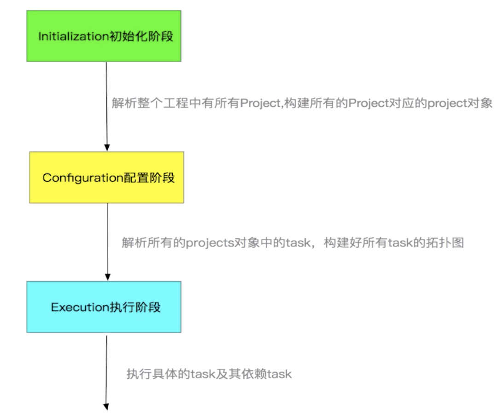

### 初始化阶段 setting.gradle
### 配置阶段的
执行各项目下的 build.gradle 脚本，完成 Project 的配置，与此同时，会构造 Task 任务依赖关系图以便在执行阶段按照依赖关系执行  Task。而在配置阶段执行的代码通常来说都会包括以下三个部分的内容，如下所示：
* build.gralde 中的各种语句。
* 闭包。
* Task 中的配置段语句。
### 执行阶段
在配置阶段结束后，Gradle 会根据各个任务 Task 的依赖关系来创建一个有向无环图然后，Gradle 构建系统会通过调用 gradle <任务名> 来执行相应的各个任务。

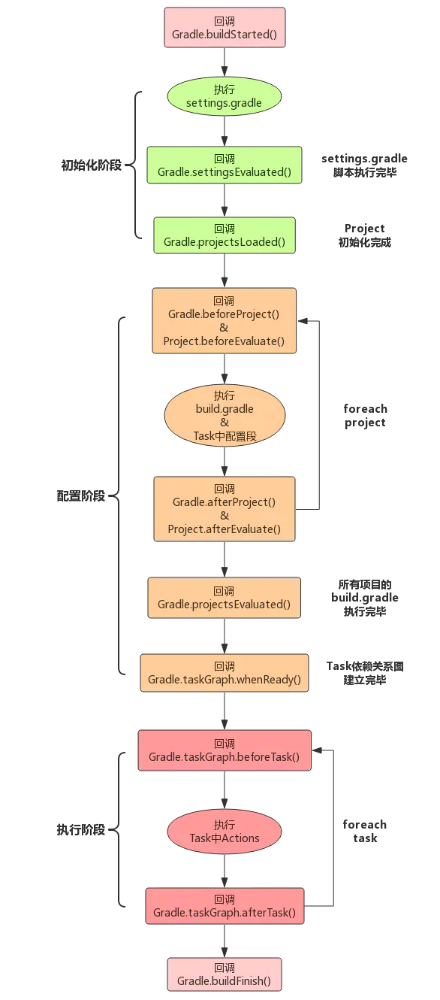

可以看到，整个 Gradle 生命周期的流程包含如下 四个部分：

* 1）、首先，解析 settings.gradle 来获取模块信息，这是初始化阶段。
* 2）、然后，配置每个模块，配置的时候并不会执行 task。
* 3）、接着，配置完了以后，有一个重要的回调 project.afterEvaluate，它表示所有的模块都已经配置完了，可以准备执行 task 了。
* 4）、最后，执行指定的 task 及其依赖的 task。

# Project
每一个 build.gradle 都有一个与之对应的 Project 实例
## Project核心API分解
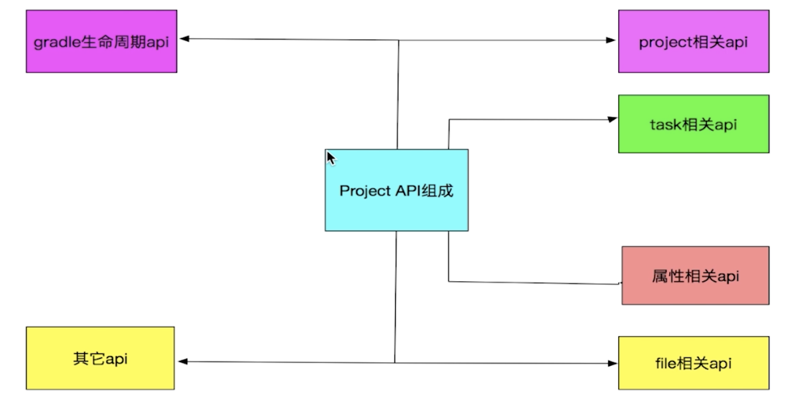

* 1）、Project API：让当前的 Project 拥有了操作它的父 Project 以及管理它的子 Project 的能力。
* 2）、Task 相关 API：为当前 Project 提供了新增 Task 以及管理已有 Task 的能力。由于 task 非常重要，我们将放到第四章来进行讲解。
* 3）、Project 属性相关的 Api：Gradle 会预先为我们提供一些 Project 属性，而属性相关的 api 让我们拥有了为 Project 添加额外属性的能力。
* 4）、File 相关 Api：Project File 相关的 API 主要用来操作我们当前 Project 下的一些文件处理。
* 5）、Gradle 生命周期 API：即我们在第二章讲解过的生命周期 API。
* 6）、其它 API：添加依赖、添加配置、引入外部文件等等零散 API 的聚合。

## Project API
Project 提供了一系列操作 Project 对象的 API：

* getProject()： 返回当前 Project；
* getParent()： 返回父 Project，如果在工程 RootProject 中调用，则会返回 null；
* getRootProject()： 返回工程 RootProject；
* getAllprojects()： 返回一个 Project Set 集合，包含当前 Project 与所有子 Project；
* getSubprojects()： 返回一个 Project Set 集合，包含所有子 Project；
* project(String)： 返回指定 Project，不存在时抛出 UnKnownProjectException；
* findProject(String)： 返回指定 Project，不存在时返回 null；
* allprojects(Closure)： 为当前 Project 以及所有子 Project 增加配置；
* subprojects(Closure)： 为所有子 Project 增加配置。

## Project 属性 API
Project 提供了一系列操作属性的 API，通过属性 API 可以实现在 Project 之间共享配置参数：

* hasProperty(String)： 判断是否存在指定属性名；
* property(Stirng)： 获取属性值，如果属性不存在则抛出 MissingPropertyException；
* findProperty(String)： 获取属性值，如果属性不存在则返回 null；

## 属性匹配优先级

Project 属性的概念比我们理解的字段概念要复杂些，不仅仅是一个简单的键值对。Project 定义了 4 种命名空间（scopes）的属性，当我们通过访问属性时，getProperty() 会按照优先顺序搜索：

* 1、自有属性： Project 对象自身持有的属性，例如 rootProject 属性；
* 2、Extension 扩展
* 3、ext 额外属性
* 4、Task 任务： 添加到 Project 上的 Task 也支持通过属性 API 访问；
* 5、父 Project 的 Extension 扩展和 Convention 对象： Extension 扩展和 Convention 对象会被子 Project 继承，因此当 1 ~ 5 未命中时，会继续从父 Project 搜索。从父 Project 继承的属性是只读的；
* 6、以上未命中，抛出 MissingPropertyException 或返回 null。
由于部分属性是只读的，因此 setProperty() 的搜索路径较短：

* 1、自有属性
* 2、ext 额外属性

# Task
只有 Task 才可以在 Gradle 的执行阶段去执行（其实质是执行的 Task 中的一系列 Action），所以 Task 的重要性不言而喻。
## Task属性
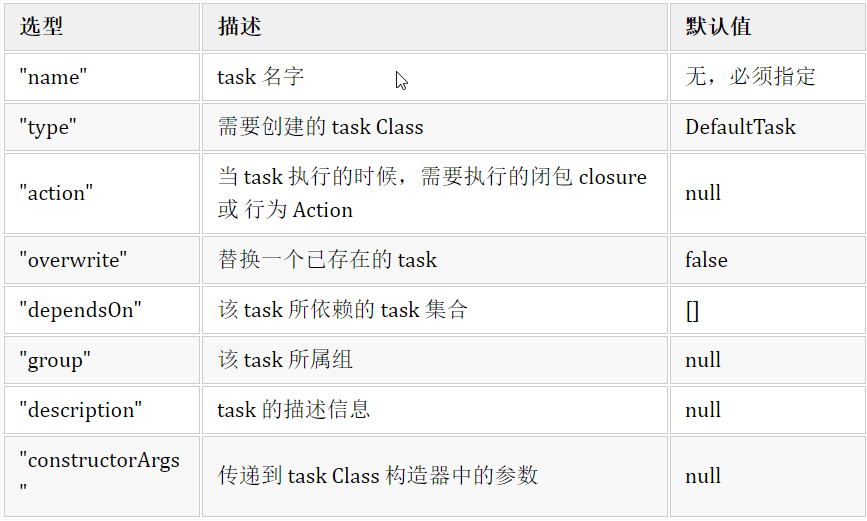

Task 通常使用 doFirst 与 doLast 两个方式用于在执行期间进行操作。

    task JsonChao
    JsonChao {
        println("hello~")
        doFirst {
            println("start")
        }
        doLast {
            println("end")
        }
    }

上例中Task JsonChao的 println("hello~")是执行在配置期间，不是执行期间
## Type
使用 type 属性来直接使用一个已有的 task 类型（很多文章都说的是继承一个已有的类，不是很准确），比如 Gradle 自带的 Copy、Delete、Sync task 等等。

    // 1、删除根目录下的 build 文件task clean
    task clean(type: Delete) {
        delete rootProject.buildDir
    }
    // 2、将 doc 复制到 build/target 目录下
    task copyDocs(type: Copy) {
        from 'src/main/doc'
        into 'build/target/doc'
    }
    // 3、执行时会复制源文件到目标目录，然后从目标目录删除所有非复制文件
    task syncFile(type:Sync) {
        from 'src/main/doc'
        into 'build/target/doc'
    }

## 挂接到构建生命周期
使用 afterEvaluate 方法 将我们第三小节定义的 writeTask 挂接到 gradle 配置完所有的 task 之后的时刻，示例代码如下所示

    // 在配置阶段执行完之后执行 writeTask
    this.project.afterEvaluate {project ->  
        def buildTask = project.tasks.findByName("build")
            doLast {
                buildTask.doLast {      
                    writeTask.execute()
            }  
        }
    }
# Gradle调试
## 配置remote debug
Android Studio中按照如下步骤操作：
Menu → Run → Edit Configurations... → Add New Configuration → Remote → 自定义配置name → host: localhost → port: 5005 → OK

## 执行gradle构建任务
在Terminal中执行需要调试的任务，同时携带-Dorg.gradle.daemon=false -Dorg.gradle.debug=true作为参数，如下：

    ./gradlew <任务名> -Dorg.gradle.daemon=false -Dorg.gradle.debug=true

之后可以看到Terminal中执行被阻塞，并输出如下：

    $ gradle assembleDebug -Dorg.gradle.daemon=false -Dorg.gradle.debug=true
    To honour the JVM settings for this build a new JVM will be forked. Please consider using the daemon: https://docs.gradle.org/3.3/userguide/gradle_daemon.html.
    > Starting Daemon

## 设置断点
在需要调试的地方设置断点，注意，*.gradle脚本是无法调试的。

## 启动debug
执行之前配置的remote debug。
# 自定义插件
## 分类
而在 Android 下的 gradle 插件共分为 两大类，如下所示：

* 1、脚本插件：同普通的 gradle 脚本编写形式一样，通过 apply from: 'JsonChao.gradle' 引用。
* 2、对象插件：通过插件全路径类名或 id 引用，它主要有 三种编写形式，如下所示：

     1）、在当前构建脚本下直接编写。
     2）、在 buildSrc 目录下编写。
     3）、在完全独立的项目中编写。

buildSrc 目录是 gradle 默认的构建目录之一，该目录下的代码会在构建时自动地进行编译打包，然后它会被添加到 buildScript 中的 classpath 下，所以不需要任何额外的配置，就可以直接被其他模块中的 gradle 脚本引用。此外，关于 buildSrc，我们还需要注意以下 两点：

* 1）、buildSrc 的执行时机不仅早于任何⼀个 project（build.gradle），而且也早于 settings.gradle。
* 2）、settings.gradle 中如果配置了 ':buildSrc' ，buildSrc ⽬录就会被当做是子 Project ， 因会它会被执行两遍。所以在 settings.gradle 里面应该删掉 ':buildSrc' 的配置。

## Variants
在 Android 对 Gradle 插件的扩展支持之中，其中最常用的便是 利用变体（Variants）来对构建过程中的各个默认的 task 进行 hook。关于 Variants 共有 三种类型，如下所示：

* 1）、applicationVariants：只适用于 app plugin。
* 2）、libraryVariants：只适用于 library plugin。
* 3）、testVariants：在 app plugin 与 libarary plugin 中都适用。
## Transform
Google 官方在 Android Gradle V1.5.0 版本以后提供了 Transfrom API, 允许第三方 Plugin 在打包成 .dex 文件之前的编译过程中操作 .class 文件
### TransformInput
TransformInput 可认为是所有输入文件的一个抽象，它主要包括两个部分，如下所示：

* 1）、DirectoryInput 集合：表示以源码方式参与项目编译的所有目录结构与其目录下的源码文件。
* 2）、JarInput 集合：表示以 jar 包方式参与项目编译的所有本地 jar 包和远程 jar 包。需要注意的是，这个 jar 所指也包括 aar。

### TransformOutputProvider
表示 Transform 的输出，利用它我们可以 获取输出路径等信息。
### 创建步骤
其创建步骤可以细分为五步，如下所示：

* 1）、重写 getName 方法：返回对应的 Task 名称。
* 2）、重写 getInputTypes 方法：确定对那些类型的结果进行转换。
* 3）、重写 getScopes 方法：指定插件的适用范围。
* 4）、重写 isIncremental 方法：表示是否支持增量更新。
* 5）、重写 transform 方法：进行具体的转换过程。

# Gradle插件架构实现原理
Gradle 插件的整体实现架构？

Android Gradle 插件更新历史有哪些重要优化或者改进？

Gradle 构建的核心流程是怎样的？

Gradle 中依赖实现的原理？

AppPlugin构建流程？

assembleDebug 打包流程？

一些很重要Task实现原理?

## Gradle 插件的整体实现架构
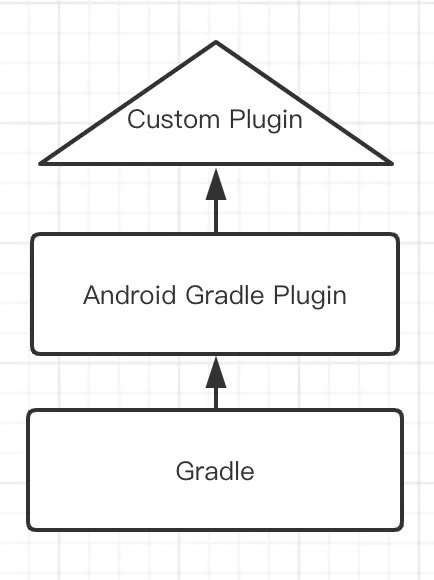
关于自定义 Plugin 通常有两种使用套路，如下所示：

* 1）、在 Android Gradle plugin 提供的 task 的基础上，插入一些自定义的 task。
* 2）、增加 Transform 进行编译时代码注入。

## Gradle 构建核心流程解析
* 1）、首先，初始化 Gradle 构建框架自身。
* 2）、然后，把命令行参数包装好送给 DefaultGradleLauncher。
* 3）、最后，触发 DefaultGradleLauncher 中 Gradle 构建的生命周期，并开始执行标准的构建流程。
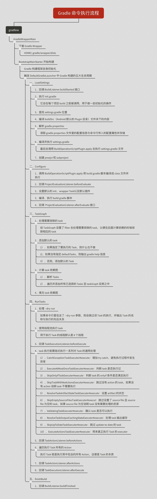

## AppPlugin 构建流程
BasePlugin#apply-> basePluginApply 中配置project,配置extentsion,创建tasks

    // 配置工程     
    threadRecorder.record(
    ExecutionType.BASE_PLUGIN_PROJECT_CONFIGURE,
    project.getPath(), 
    null, 
    this::configureProject);
    
    // 配置 Extension        threadRecorder.record(
    ExecutionType.BASE_PLUGIN_PROJECT_BASE_EXTENSION_CREATION,
    project.getPath(),
    null,
    this::configureExtension);
    
    // 创建 Tasks        
    threadRecorder.record(
    ExecutionType.BASE_PLUGIN_PROJECT_TASKS_CREATION,
    project.getPath(),
    null,
    this::createTasks);

configureExtension中就是我们比较熟悉的builid.gradle的使用

    // 3、创建 android DSL 闭包。        
    extension = 
    createExtension(
    project,
    projectOptions,
    globalScope,
    buildTypeContainer,
    productFlavorContainer,
    signingConfigContainer,
    buildOutputs,
    sourceSetManager,
    extraModelInfo);
    
    // 4、给全局域设置创建好的 android DSL 闭包。
    globalScope.setExtension(extension);
    
    // 5、创建一个 ApplicationVariantFactory 实例，以用于生产 APKs。
    variantFactory = createVariantFactory(globalScope);
    
    // 6、创建一个 ApplicationTaskManager 实例，负责为 Android 应用工程去创建 Tasks。        
    taskManager =
    createTaskManager(
    globalScope,
    project,
    projectOptions,
    dataBindingBuilder,
    extension,
    variantFactory,
    registry,
    threadRecorder);
    
    // 7、创建一个 VariantManager 实例，用于去创建与管理 Variant。        
    variantManager =
    new VariantManager(
    globalScope,
    project,
    projectOptions,
    extension,
    variantFactory,
    taskManager,
    sourceSetManager,
    threadRecorder);

## assembleDebug 打包流程
比较详细的打包流程可简述为如下 八个步骤：

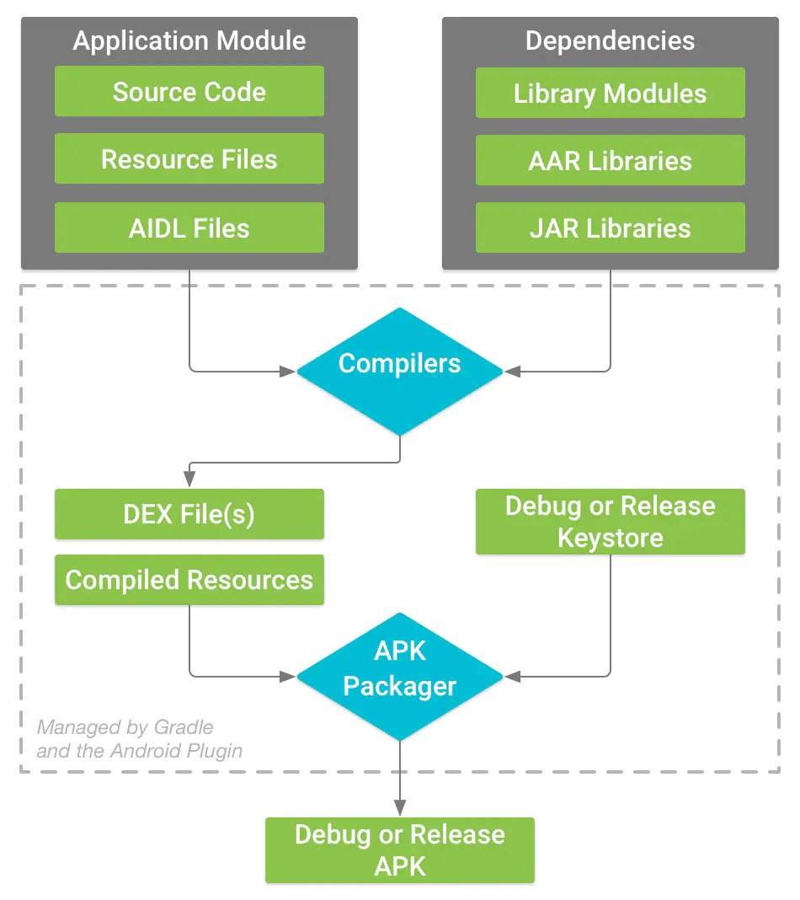

* 1、首先，.aidl（Android Interface Description Language）文件需要通过 aidl 工具转换成编译器能够处理的 Java 接口文件。
* 2、同时，资源文件（包括 AndroidManifest.xml、布局文件、各种 xml 资源等等）将被 AAPT（Asset Packaging Tool）（Android Gradle Plugin 3.0.0 及之后使用 AAPT2 替代了 AAPT）处理为最终的 resources.arsc，并生成 R.java 文件以保证源码编写时可以方便地访问到这些资源。
* 3、然后，通过 Java Compiler 编译 R.java、Java 接口文件、Java 源文件，最终它们会统一被编译成 .class 文件。
* 4、因为 .class 并不是 Android 系统所能识别的格式，所以还需要通过 dex 工具将它们转化为相应的 Dalvik 字节码（包含压缩常量池以及清除冗余信息等工作）。这个过程中还会加入应用所依赖的所有 “第三方库”。
* 5、下一步，通过 ApkBuilder 工具将资源文件、DEX 文件打包生成 APK 文件。
* 6、接着，系统将上面生成的 DEX、资源包以及其它资源通过 apkbuilder 生成初始的 APK 文件包。
* 7、然后，通过签名工具 Jarsigner 或者其它签名工具对 APK 进行签名得到签名后的 APK。如果是在 Debug 模式下，签名所用的 keystore 是系统自带的默认值，否则我们需要提供自己的私钥以完成签名过程。
* 8、最后，如果是正式版的 APK，还会利用 ZipAlign 工具进行对齐处理，以提高程序的加载和运行速度。而对齐的过程就是将 APK 文件中所有的资源文件距离文件的起始位置都偏移4字节的整数倍，这样通过 mmap 访问 APK 文件的速度会更快，并且会减少其在设备上运行时的内存占用。

目前，在 Gradle Plugin 中主要有三种类型的 Task，如下所示：

* 1）、增量 Task：继承于 NewIncrementalTask 这个增量 Task 基类，需要重写 doTaskAction 抽象方法实现增量功能。
* 2）、非增量 Task：继承于 NonIncrementalTask 这个非增量 Task 基类，重写 doTaskAction 抽象方法实现全量更新功能。
* 3）、Transform Task：我们编写的每一个自定义 Transform 会在调用 appExtension.registerTransform(new CustomTransform()) 注册方法时将其保存到当前的 Extension 类中的 transforms 列表中，当 LibraryTaskManager/TaskManager 调用 createPostCompilationTasks（负责为给定 Variant 创建编译后的 task）方法时，会取出相应 Extension 中的 tranforms 列表进行遍历，并通过 TransformManager.addTransform 方法将每一个 Transform 转换为与之对应的 TransformTask 实例，而该方法内部具体是通过 new TransformTask.CreationAction(...) 的形式进行创建。

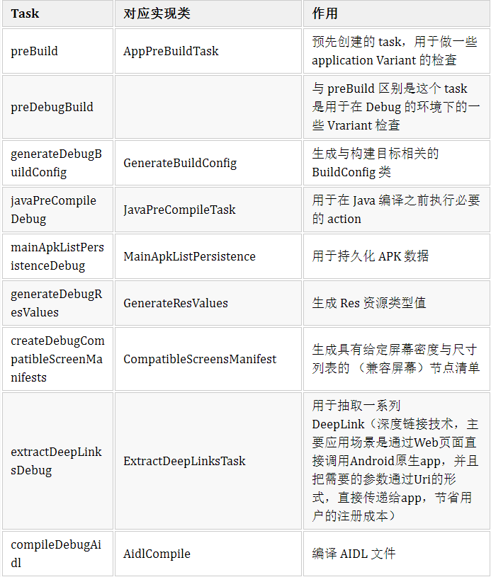
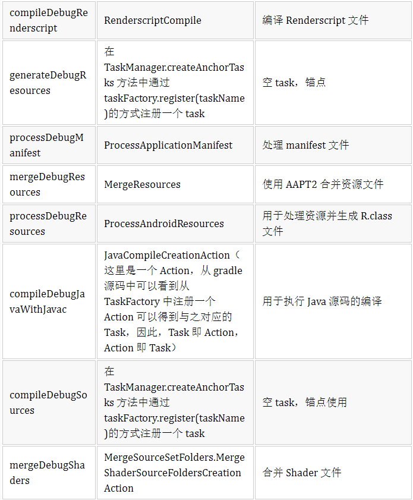
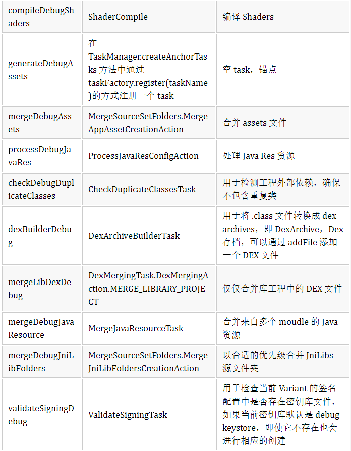
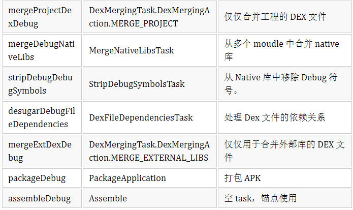
## 重要Task实现源码分析

* 1）、processDebugManifest,重点是在合并 flavors 并且构建与之对应的 manifest 文件,最后保存 manifest 到 build/intermediates/merged_manifests/flavorName/AndroidManifest.xml
* 2）、mergeDebugResources
* 3）dexBuilderDebug，对class的处理方式分为两种，一种是对 目录下的class进行处理，一种是对.jar里面的class进行处理。在处理 jar 包的时候，Gradle 会对 jar 包中的每一个 class 文件都单独打成一个 DEX 文件，然后再把它们放回 jar 包之中。DexArchiveBuilder 有两个子类，它们分别如下所示：D8DexArchiveBuilder：调用 D8 去生成 DEX 文件。DxDexArchiveBuilder：调用 DX 去生成 DEX 文件。
